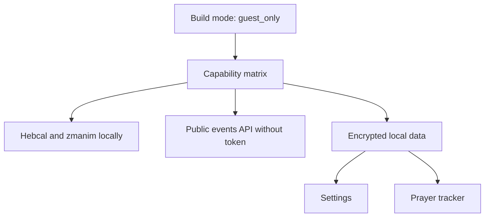
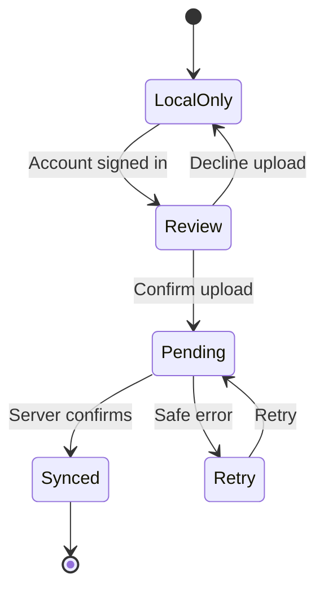

# «Среди Своих» — гостевой старт приложения и последующее включение аккаунтов

- Версия: 1.1
- Дата: 9 августа 2026 года
- Статус: план реализации для согласования
- Репозиторий: `timafor-code/sredi-svoih-app`
- Локальный путь на компьютере владельца: `F:\2026\SS-App\md\app-start.md`
- Рекомендуемый путь в репозитории: `docs/app-start.md`

## 1. Текущий контекст проекта

Мы работаем в проекте `sredi-svoih-app`.

- Основная ветка: `main`.
- Открытых PR на момент проверки нет.
- Последний объединённый PR: [#356 Complete public event questionnaires](https://github.com/timafor-code/sredi-svoih-app/pull/356).
- Предыдущие объединённые PR: [#355 Add admin event questionnaire UI](https://github.com/timafor-code/sredi-svoih-app/pull/355), [#354 Add web event questionnaire foundation](https://github.com/timafor-code/sredi-svoih-app/pull/354).
- Mobile, web-admin и public web используют общий Python API и PostgreSQL; возвращать Supabase в production runtime нельзя.
- Публичные события уже читаются API без обязательной авторизации.
- Текущий mobile prayer tracker — только API-контур `/me/prayer-logs` и требует пользователя.
- Город, источник зманим и режим отображения благословений уже сохраняются локально.
- Нусах и настройки уведомлений сейчас являются частью профиля в БД и без входа полноценно не работают.
- В текущем `app.json` включён `ios.usesAppleSignIn`; в guest binary этот entitlement нужно убрать. `eas.json` в репозитории сейчас отсутствует.

Документ продолжает принципы `plan.md` и `webreg.md`: единый источник истины, маленькие сфокусированные PR, строгая privacy boundary, обязательный expected scope, автоматические проверки до commit, ручной smoke владельцем и commit/push агентом без merge.

## 2. Продуктовое решение

### 2.1. Первый публичный релиз

Первый релиз приложения выпускается в режиме `guest_only`:

- на экранах нет логина, пароля, регистрации аккаунта, восстановления пароля и social sign-in;
- приложение не загружает auth session и не отправляет bearer token;
- старые локальные auth-токены от beta-сборок игнорируются и безопасно удаляются с устройства;
- серверные аккаунты и уже сохранённые данные не удаляются;
- Главная, еврейский календарь, зманим, молитвы, благословения и публичные события работают без аккаунта;
- настройки сохраняются на устройстве;
- молитвенный трекер сохраняется на устройстве и не передаётся на сервер;
- каталог общины, профиль, invite-коды, «Мои записи», remote push и другие account-only функции скрыты;
- internal mobile registration на события не предлагает войти в приложение.

Это не «анонимный аккаунт». В guest release вообще не создаётся пользовательская запись и не выполняется скрытая авторизация.

### 2.2. Следующий релиз с аккаунтами

В следующей версии после отдельного решения владельца и прохождения legal/hosting gates включается режим `account`:

- возвращается существующий вход и регистрация;
- пользователь после входа отдельно выбирает, переносить ли локальные настройки;
- перед передачей молитвенной истории показывается отдельное информированное подтверждение;
- отказ от синхронизации не блокирует аккаунт: молитвенный трекер может продолжить работать локально;
- успешная синхронизация объединяет локальные и серверные записи без дублей;
- включение аккаунтов требует новой версии приложения и нового binary, а не удалённого переключателя.

### 2.3. Регистрация на события — отдельная возможность

Нельзя связывать в одном флаге две разные вещи:

1. создание аккаунта приложения;
2. регистрация на мероприятие через public web.

Для первого guest release безопасное значение — `disabled`: приложение показывает публичное событие, но не начинает сбор персональных данных и не пишет «нужен вход».

После отдельного подтверждения готовности production public web можно включить `public_web`: кнопка события открывает каноническую веб-страницу, работающую без пароля по правилам `webreg.md`. Это не включает mobile account UI.

## 3. Матрица возможностей

| Возможность | `guest_only` | `account` после обновления |
| --- | --- | --- |
| Главная, дата, зманим, календарь | Да, локально | Да |
| Недельная глава | Да, из Hebcal | Да |
| Публичные события | Да, anonymous API | Да |
| Internal mobile registration | Нет | Да, после отдельного release gate |
| Public web registration | Выключено до legal gate; затем внешний переход | Может остаться доступной |
| Локальные iPhone-контакты | По разрешению устройства | По разрешению устройства |
| Каталог участников общины | Нет | По membership и backend policy |
| Настройки города, нусаха, благословений | Локально | Локально или синхронизировано по выбору |
| Настройки локальных уведомлений | Локально | Локально; поддерживаемые предпочтения можно синхронизировать |
| Prayer tracker | Зашифрованно на устройстве | Локально либо серверно по выбору |
| Remote push token | Нет | После отдельного согласия и backend gate |
| Профиль, безопасность, invite-код | Нет в UI и deep links | Да |
| «Мои записи» | Нет | Да |

## 4. Аудит Главной страницы и хардкода

Проверены:

- [`app/(tabs)/index.tsx`](https://github.com/timafor-code/sredi-svoih-app/blob/main/app/(tabs)/index.tsx);
- [`HomeParshaCard.tsx`](https://github.com/timafor-code/sredi-svoih-app/blob/main/src/components/home/HomeParshaCard.tsx);
- [`hebcal.ts`](https://github.com/timafor-code/sredi-svoih-app/blob/main/src/lib/hebcal.ts);
- [`hebcalRu.ts`](https://github.com/timafor-code/sredi-svoih-app/blob/main/src/lib/hebcalRu.ts);
- остальные `Home*` components и `homeEvents.ts`.

### 4.1. Что уже динамическое и не является проблемным хардкодом

| Блок | Источник |
| --- | --- |
| Еврейская дата | `@hebcal/core`, с учётом заката и выбранной локации |
| Недельная глава | `getSedra()` / `getWeeklyParsha()` |
| Праздник | Hebcal calendar |
| Зажигание свечей и зманим | локальный расчёт по городу |
| Ближайшее событие | публичный Events API и `selectHomeEvent()` |
| Ближайший Шабат | публичные события с `eventKind = shabbat` |
| Дни рождения | community contacts и/или разрешённые iPhone contacts |
| Переводы названий глав | статический allowlisted localization catalog |

UI-тексты, подписи, emoji и дизайн-токены являются нормальным статическим контентом. Их не нужно переносить в БД только ради устранения хардкода.

### 4.2. Найденные проблемы

| Приоритет | Место | Проблема | Решение |
| --- | --- | --- | --- |
| P0 | `HomeParshaCard.tsx` | Всегда показывается «Урок раввина Рувена Колина», хотя урок и преподаватель не приходят из данных | Удалить строку и иконку из текущей карточки. Возвращать только вместе с реальной сущностью published weekly content |
| P0 | `hebcalRu.ts` | `parshaNameRu()` сначала разбивает любое имя по `-`. Из-за этого одиночная глава `Lech-Lecha`, уже имеющая точный перевод в map, может остаться на английском | Сначала проверять точное совпадение `PARSHA_RU[name]`, только затем разбирать неизвестную составную строку |
| P1 | `index.tsx` + `HomeParshaCard.tsx` | В праздничный Шабат `getWeeklyParsha()` возвращает `null`, но карточка получает имя праздника с заголовком «НЕДЕЛЬНАЯ ГЛАВА» | Передавать тип карточки: `parsha` или `holiday_reading`; менять overline на «ПРАЗДНИЧНОЕ ЧТЕНИЕ» |
| P1 | `HomeLocationPill.tsx` | Chevron обещает переход, но pill не является кнопкой | Сделать pressable и открыть существующий city picker либо убрать chevron |
| P1 | `HomeBirthdaysCard.tsx` / `SectionTitle.tsx` | «Все контакты →» выглядит как действие, но это обычный `Text` | Добавить callback и навигацию либо убрать action |
| P1 | `HomeCandleLightingCard.tsx` | Кнопка «Записаться на Шабат» активна даже при отсутствии опубликованного события и приводит только к alert | Передавать доступность и корректное состояние кнопки из `homeShabbatEvent` |
| P0 вне Home | `app/(tabs)/profile.tsx` | В production UI видны `AuthCard`, security links и тестовый invite-код `DEV-SREDI-2026` | Полностью исключить account UI и dev invite copy из guest build |
| P0 вне Home | `app.json` | Включён `ios.usesAppleSignIn`, хотя guest release не должен объявлять account capability | Убрать entitlement из guest release config; вернуть только в новой account version |

### 4.3. Будущие уроки по недельной главе

Не следует сейчас заменять одну захардкоженную фамилию другой. Если на Главной нужен реальный урок, после guest release вводится отдельный public content contract:

```text
weekly_content
- id
- content_type: parsha_lesson
- parsha_key
- diaspora_schedule / israel_schedule
- hebrew_year
- title
- speaker_display_name
- media_url
- published_at
- status
```

Карточка показывает преподавателя только при наличии опубликованной записи, соответствующей вычисленной главе. До появления такого источника карточка содержит только название главы.

## 5. Целевая архитектура guest release



### 5.1. Центральная capability matrix

Добавить один модуль, например `src/config/appCapabilities.ts`.

Он строго разбирает build-time значение:

```text
EXPO_PUBLIC_APP_ACCESS_MODE=guest_only | account
EXPO_PUBLIC_EVENT_REGISTRATION_MODE=disabled | public_web | account
```

Правила:

- неизвестное значение в production означает `guest_only` / `disabled`;
- development может явно использовать `account` для поддержки существующего контура;
- production profile обязан задавать значения явно;
- remote config не используется;
- UI, routes, API token provider и stores читают одну capability matrix, а не собственные env-проверки;
- скрытие UI не считается security boundary: guest API client также физически не прикладывает токен и не вызывает account endpoints.

### 5.2. Boot flow

Guest boot:

1. Прочитать release mode.
2. Инициализировать локальную БД и выполнить локальные migrations.
3. Гидратировать настройки.
4. Не вызывать `useAuthStore.loadSession()`.
5. В token provider возвращать `null`, даже если от beta-сборки остался token.
6. Один раз очистить старые device credentials и account-only memory cache; серверные записи не трогать.
7. Загрузить только публичные события.
8. Работать с local prayer provider.
9. Community contacts не запрашивать; iPhone contacts читать только после системного разрешения.

Account boot после будущего обновления:

1. Инициализировать ту же локальную БД.
2. Загрузить auth session.
3. До синхронизации продолжать показывать локальные данные.
4. После входа выполнить sync discovery и показать выбор пользователю.
5. Переключить provider только после завершения либо явного отказа.

## 6. Локальное хранение

### 6.1. Почему не хранить prayer history в SecureStore

`expo-secure-store` подходит для коротких секретов и ключей, но не для растущего журнала: underlying platform может отклонять большие payload. Текущая документация Expo отдельно предупреждает о больших значениях. Поэтому SecureStore используется для ключа БД и auth credentials, но не как журнал молитв.

Источники: [Expo SecureStore](https://docs.expo.dev/versions/latest/sdk/securestore/), [Expo SQLite](https://docs.expo.dev/versions/latest/sdk/sqlite/).

### 6.2. Рекомендуемое хранилище

На iOS/Android:

- `expo-sqlite` для структуры и migrations;
- SQLCipher в production/TestFlight/EAS development build;
- случайный ключ БД генерируется через `expo-crypto`;
- ключ хранится в SecureStore с device-only accessibility;
- SQL-запросы используют placeholders/prepared statements;
- БД исключается из cloud backup/device transfer, насколько это допускает platform configuration;
- значения молитвенной истории, metadata и настройки не пишутся в logs.

SQLCipher не поддерживается в Expo Go. Поэтому:

- Expo Go остаётся допустимым для UI smoke только на синтетических данных;
- проверка реального encrypted persistence выполняется владельцем в EAS development build или TestFlight;
- Codex/Claude Code не запускают smoke сами;
- production release нельзя принимать только по Expo Go.

Для web demo local prayer persistence не является production-контуром. Допустим отдельный dev adapter с синтетическими данными; он не должен автоматически синхронизироваться.

### 6.3. Локальные migrations

Нужен версионируемый runner, отдельный от Alembic:

```text
local_schema_migrations
- version INTEGER PRIMARY KEY
- applied_at TEXT NOT NULL
```

Каждая migration выполняется транзакционно. При ошибке приложение не должно молча создавать пустую БД поверх существующей.

### 6.4. Настройки

Хранить allowlisted настройки по ключам с `updated_at` и `source`:

```text
local_preferences
- key TEXT PRIMARY KEY
- value_json TEXT NOT NULL
- updated_at TEXT NOT NULL
- source TEXT NOT NULL
- schema_version INTEGER NOT NULL
```

Минимальный allowlist:

- `city`;
- `zmanimSource`;
- `gpsCity`;
- `customGpsLocation` — только локально, не синхронизировать;
- `locationPermissionStatus` — только локально;
- `nusach`;
- `blessingDefaultDisplayMode`;
- `notificationPreferences`;
- `prayerStorageMode`;
- `lastAccountSyncDecision` — без tokens и без prayer content.

Нужна одноразовая migration текущего `sredi-svoih.settings.v1` из SecureStore в local database. Старый ключ удаляется только после успешной транзакции и read-back проверки.

### 6.5. Prayer tracker schema

```text
local_prayer_logs
- local_id TEXT PRIMARY KEY
- owner_scope TEXT NOT NULL DEFAULT 'guest'
- activity_type TEXT NOT NULL
- activity_date TEXT NOT NULL
- started_at TEXT NULL
- completed_at TEXT NULL
- timezone TEXT NOT NULL
- city TEXT NULL
- hebrew_date_json TEXT NOT NULL
- metadata_json TEXT NOT NULL
- created_at TEXT NOT NULL
- updated_at TEXT NOT NULL
- sync_state TEXT NOT NULL
- synced_user_id TEXT NULL
- server_id TEXT NULL
- last_sync_error_code TEXT NULL

UNIQUE(owner_scope, activity_date, activity_type)
```

`sync_state`:

- `local_only` — запись никогда не отправлялась;
- `pending` — пользователь подтвердил передачу, идёт/ожидается upload;
- `synced` — backend подтвердил canonical row;
- `error` — безопасная повторяемая ошибка без удаления local row.

Не хранить raw email, телефон, имя, JWT, refresh token или verification code в этой таблице.

### 6.6. Потеря ключа

Если encrypted DB существует, но ключ SecureStore недоступен:

- не генерировать новый ключ поверх существующей БД;
- показать нейтральную ошибку;
- предложить явное действие «Удалить локальные данные и начать заново»;
- до подтверждения не удалять файл;
- не отправлять содержимое или имя пользователя в telemetry.

## 7. Изменения экранов в guest mode

### 7.1. Root и navigation

- Root layout не загружает session в `guest_only`.
- Route guard блокирует account-only deep links.
- Tab `Профиль` становится `Настройки`; внутренний route можно временно сохранить ради маленького diff.
- Иконка tab в guest mode — settings, а не person.

### 7.2. Экран «Настройки»

Показывать:

- город и источник зманим;
- нусах;
- отображение благословений;
- локальные уведомления;
- молитвенный трекер и локальную историю;
- «Удалить локальную молитвенную историю»;
- «Сбросить локальные настройки»;
- поддержать общину;
- о приложении и privacy notice.

Не показывать:

- AuthCard;
- email/password fields;
- Apple/Google sign-in;
- восстановление пароля;
- редактирование account profile;
- account security;
- invite-код и `DEV-SREDI-2026`;
- membership/role;
- «Мои записи»;
- sign out.

Не показывать даже disabled-карточки с текстом «Войдите для доступа»: это всё равно account UI, который решено отложить.

### 7.3. Prayer tracker

Нужно убрать прямую зависимость UI от `authUser`:

- `PrayerActionModal` вызывает provider, а не проверяет пользователя;
- Home, Morning Shema, Prayers, Omer и history используют одну локальную дату и один domain key;
- existing uniqueness `activity_date + activity_type` сохраняется локально;
- записанное состояние работает после перезапуска;
- history и summary строятся локально;
- пользователь может удалить одну запись или всю локальную историю;
- admin никогда не получает эти данные.

### 7.4. Контакты и дни рождения

В guest mode:

- community contacts endpoint не вызывается;
- Home показывает только дни рождения из разрешённых iPhone contacts;
- системное разрешение запрашивается только по явному действию пользователя;
- отказ не ломает Главную;
- экран community contact и соответствующие deep links закрыты.

### 7.5. События

- Список и карточки публичных событий продолжают работать через anonymous API.
- Members-only события не должны становиться публичными из-за guest mode.
- `internal_free` и `internal_paid` не должны открывать account registration screens в guest release.
- При `EVENT_REGISTRATION_MODE=disabled` показывать нейтральное состояние без login CTA.
- При будущем `public_web` URL формируется доверенным backend contract; mobile не склеивает production URL из случайного admin input.
- `external_link` допускается только для уже опубликованного безопасного URL события.

### 7.6. Уведомления

В guest mode:

- preference toggles и quiet hours сохраняются локально;
- локальные Hebcal/zmanim reminders разрешены;
- push-token registration скрыт;
- community news remote push скрыт или отмечен недоступным без попытки регистрации token;
- точные GPS coordinates не отправляются на сервер;
- OS permission status остаётся device-only и никогда не синхронизируется.

## 8. Будущая синхронизация после включения аккаунтов

### 8.1. Принцип

Вход в аккаунт не является согласием передать молитвенную историю. Нужны два независимых решения:

1. использовать настройки устройства или настройки аккаунта;
2. передать или не передавать молитвенную историю.



### 8.2. Sync discovery

После входа клиент получает:

- server profile/preferences;
- server prayer summary и нужный диапазон logs;
- количество local-only записей;
- наличие конфликтов по `activity_date + activity_type`.

До решения пользователя upload не выполняется.

### 8.3. Настройки

Для каждого allowlisted поля показывается источник:

- «На этом устройстве»;
- «В аккаунте».

Рекомендуемое действие для человека, впервые открывшего аккаунт после guest release: «Использовать настройки этого устройства».

Но если server value уже явно менялось, нельзя молча его перезаписывать. Пользователь выбирает:

- применить настройки устройства к аккаунту;
- загрузить настройки аккаунта на устройство;
- настроить позже.

Никогда не загружать в профиль:

- GPS coordinates;
- location permission status;
- device identifiers;
- OS notification permission.

### 8.4. Prayer logs

Рекомендуется отдельный authenticated batch endpoint, например:

```text
POST /me/prayer-logs/import
```

Требования:

- максимум 500 записей в batch;
- request принимает opaque `client_record_id` только для корреляции ответа;
- backend определяет `user_id` только из current session;
- никакого `user_id` в request body;
- идемпотентность обеспечивается существующим domain key пользователя: `activity_date + activity_type`;
- повторный batch не создаёт дубли;
- existing server row сохраняет server `id` и `created_at`;
- при конфликте server non-null values не перетираются автоматически, local может заполнить только отсутствующие поля;
- metadata объединяется allowlisted способом без raw PII;
- response возвращает результат для каждого `client_record_id`;
- logs не содержат prayer payload.

После подтверждённого ответа клиент отмечает local row как `synced`, но не удаляет его автоматически.

### 8.5. Поведение при ошибках

- При offline/timeout local rows остаются `pending` или `error`.
- Retry безопасен и не создаёт дубли.
- Пользователь продолжает видеть локальную историю.
- Частично успешный batch отмечает только подтверждённые строки.
- Нельзя переключать UI на пустой server provider до завершения merge.

### 8.6. Несколько устройств и разные аккаунты

- Guest history принадлежит устройству, а не доказанной личности.
- При входе другим аккаунтом нельзя автоматически отправлять существующую local history.
- На каждом устройстве требуется отдельное подтверждение.
- Server после подтверждённой синхронизации становится canonical account source.
- Sign out очищает account cache, но не удаляет guest history без отдельного действия.

### 8.7. Удаление

Разделить три действия:

1. «Удалить данные с этого устройства» — hard delete local rows/settings после подтверждения.
2. «Удалить молитвенную историю аккаунта» — authenticated privacy/backend flow.
3. «Удалить аккаунт и персональные данные» — общий privacy erasure flow.

Нельзя обещать, что локальное удаление удалило server data, и наоборот.

## 9. Privacy и security gates

До guest release:

- [ ] Account UI отсутствует в production build и deep links.
- [ ] API client в guest mode не прикладывает bearer token.
- [ ] Старые device auth credentials не используются.
- [ ] Prayer history не покидает устройство.
- [ ] Production prayer DB зашифрована; ключ не хранится в БД или JS bundle.
- [ ] Локальная БД исключена из backup/device transfer либо риск отдельно принят владельцем.
- [ ] Нет raw prayer data в logs, analytics, crash reports и notifications payload.
- [ ] Есть локальное удаление истории и сброс настроек.
- [ ] Community contacts не запрашиваются в guest mode.
- [ ] Internal event registration не показывает login CTA.
- [ ] Public web registration остаётся выключенной до отдельного legal/hosting разрешения.
- [ ] Privacy notice точно объясняет: что хранится только на устройстве, что исчезает при удалении приложения и что может остаться после будущей синхронизации.

До account release:

- [ ] Выполнены актуальные legal и hosting gates по ПД РФ.
- [ ] Sync требует явного подтверждения prayer upload.
- [ ] Есть conflict preview и безопасный retry.
- [ ] Batch endpoint идемпотентен и current-user scoped.
- [ ] Проверен upgrade с реальной предыдущей guest version, а не только fresh install.
- [ ] Проверены decline, partial failure, offline, second device, second account и sign out.
- [ ] Server erasure и local deletion описаны раздельно.

## 10. План реализации маленькими PR

Нумерация ниже относится только к серии `app-start`. Перед каждым PR агент обязан заново проверить latest merged PR и фактические пути.

### PR 1 — `docs/mobile-guest-release-contract`

Цель: добавить утверждённый документ в репозиторий.

Do:

- добавить `docs/app-start.md`;
- сверить ссылки и фактические названия текущих файлов;
- зафиксировать решения без runtime code.

Do not:

- не менять mobile/API/admin/web;
- не добавлять dependencies или env.

Expected scope:

```text
docs/app-start.md
```

### PR 2 — `fix/mobile-home-parsha-content`

Цель: устранить функциональный хардкод недельной главы.

Do:

- исправить exact-match перевод `Lech-Lecha` и аналогичных ключей;
- убрать постоянную строку с преподавателем;
- различать обычную главу и праздничное чтение;
- добавить focused automated validation/test в подтверждённую test infrastructure.

Do not:

- не создавать CMS, weekly API или blogs;
- не менять events, auth и guest storage.

Expected scope:

```text
app/(tabs)/index.tsx
src/components/home/HomeParshaCard.tsx
src/lib/hebcalRu.ts
<focused hebcal/parsha test files confirmed by repository>
package.json                         # только если нужен подтверждённый test script
```

### PR 3 — `fix/mobile-home-action-affordances`

Цель: привести действия Главной в соответствие с реальным поведением.

Do:

- сделать city pill рабочим или убрать ложный chevron;
- сделать «Все контакты» рабочим или убрать ложное действие;
- передавать корректное disabled/empty state в Shabbat registration button.

Do not:

- не менять account access и event registration backend;
- не делать визуальный редизайн Главной.

Expected scope:

```text
app/(tabs)/index.tsx
src/components/home/HomeLocationPill.tsx
src/components/home/HomeBirthdaysCard.tsx
src/components/home/HomeSectionTitle.tsx
src/components/home/HomeCandleLightingCard.tsx
src/components/ui/SectionTitle.tsx             # только если нужен action callback
```

### PR 4 — `feature/mobile-release-capability-matrix`

Цель: один строгий build-time contract для guest/account возможностей.

Do:

- добавить allowlisted access и event-registration modes;
- добавить fail-closed production defaults;
- добавить unit tests parser/capabilities;
- документировать env без secrets.

Do not:

- пока не переделывать screens/stores;
- не добавлять remote config;
- не удалять auth code.

Expected scope:

```text
src/config/appCapabilities.ts
src/config/<focused tests>
app.json                             # только public non-secret configuration
docs/app-start.md
```

### PR 5 — `feature/mobile-encrypted-local-data-foundation`

Цель: добавить local DB, SQLCipher production config, key management и migrations без UI switch.

Do:

- установить совместимую с текущим Expo SDK версию `expo-sqlite` через `npx expo install`;
- создать DB bootstrap, key store, migration runner и recovery state;
- использовать prepared statements;
- добавить focused tests pure migration/schema logic;
- не включать encrypted provider до готовности следующих PR.

Do not:

- не менять auth/provider/UI;
- не хранить DB key в env, source или SQLite;
- не заявлять SQLCipher smoke по Expo Go.

Expected scope:

```text
package.json
package-lock.json
app.json
src/local-data/database.ts
src/local-data/keyStore.ts
src/local-data/migrations/**
src/local-data/types.ts
src/local-data/<focused tests>
docs/app-start.md
```

### PR 6 — `feature/mobile-local-preferences-migration`

Цель: перенести все guest preferences в local repository и добавить нусах/уведомления.

Do:

- добавить allowlisted preference repository;
- мигрировать текущий settings key только после успешной проверки;
- расширить `useSettingsStore` нусахом и notification preferences;
- оставить precise GPS и OS permission строго local-only.

Do not:

- не менять UI;
- не вызывать profile update;
- не синхронизировать данные.

Expected scope:

```text
src/local-data/preferencesRepository.ts
src/store/useSettingsStore.ts
src/types/profile.ts or a new local preference type file
src/local-data/<focused tests>
```

### PR 7 — `feature/mobile-local-prayer-repository`

Цель: реализовать local prayer CRUD, uniqueness, history и summary без screen changes.

Do:

- создать таблицу и repository;
- повторить текущие domain constraints activity type/date;
- добавить idempotent upsert, list filters, summary и delete;
- добавить sync-state fields, но не отправлять данные.

Do not:

- не вызывать `/me/prayer-logs`;
- не менять backend;
- не подключать UI.

Expected scope:

```text
src/local-data/migrations/<prayer migration>
src/local-data/prayerRepository.ts
src/types/prayerTracker.ts
src/local-data/<focused tests>
```

### PR 8 — `feature/mobile-prayer-provider-selection`

Цель: абстрагировать store от API и выбрать local provider в guest mode.

Do:

- ввести единый repository/provider contract;
- сохранить API provider для account mode;
- перевести `usePrayerTrackerStore` на provider;
- не терять existing API behavior в development account mode.

Do not:

- не менять визуальные экраны;
- не добавлять sync;
- не читать server logs в guest mode.

Expected scope:

```text
src/services/prayerTrackerService.ts
src/services/prayerTrackerApiService.ts       # только adapter alignment
src/local-data/prayerRepository.ts
src/store/usePrayerTrackerStore.ts
src/types/prayerTracker.ts
src/store/<focused tests>
```

### PR 9 — `feature/mobile-guest-prayer-actions`

Цель: Home, Prayers, Shema и Omer записывают молитву локально без auth alert.

Do:

- убрать UI-level requirement `authUser`;
- использовать provider identity/domain key;
- сохранить time gates и recorded badges;
- проверить повторную запись в тот же день.

Do not:

- не менять history screen и settings shell;
- не добавлять sync/account UI.

Expected scope:

```text
app/(tabs)/index.tsx
app/(tabs)/prayers.tsx
app/modals/omer.tsx
src/components/prayer/PrayerActionModal.tsx
src/components/prayer/MorningShemaCard.tsx
src/lib/prayerTracker.ts
```

### PR 10 — `feature/mobile-guest-prayer-history-controls`

Цель: локальная история, summary и локальное удаление доступны без аккаунта.

Do:

- перевести history screen на provider;
- добавить удаление одной записи и всей local history с подтверждением;
- точно описать, что local deletion не удаляет future server data.

Do not:

- не добавлять server erasure;
- не делать streak/social/leaderboard;
- не показывать prayer data админам.

Expected scope:

```text
app/profile/prayer-tracker.tsx
src/store/usePrayerTrackerStore.ts
src/local-data/prayerRepository.ts
src/components/prayer/<focused history controls if needed>
```

### PR 11 — `feature/mobile-guest-runtime-boundaries`

Цель: guest boot не использует auth/member endpoints и закрывает account deep links.

Do:

- условно отключить session load;
- сделать token provider fail-closed;
- безопасно очистить старые device credentials один раз;
- отключить community contacts requests;
- добавить route guards account-only screens.

Do not:

- не удалять server accounts/data;
- не менять public events API;
- не включать guest UI до полной capability проверки.

Expected scope:

```text
app/_layout.tsx
src/services/apiAuthTokenStore.ts
src/store/useAuthStore.ts
src/store/useContactsStore.ts
src/services/contactsService.ts or communityContactsService.ts
src/config/appCapabilities.ts
src/navigation/<route guard if introduced>
<focused tests>
```

### PR 12 — `feature/mobile-guest-settings-shell`

Цель: заменить account Profile UI гостевым экраном «Настройки».

Do:

- динамически изменить tab label/icon;
- вывести только local/practice/about/support sections;
- убрать все login/signup/security/invite/account copy;
- открыть prayer settings/history и local notifications.

Do not:

- не удалять auth components из repository;
- не показывать disabled account cards;
- не менять backend.

Expected scope:

```text
app/(tabs)/_layout.tsx
app/(tabs)/profile.tsx
src/config/appCapabilities.ts
src/components/settings/<guest components if extracted>
```

### PR 13 — `feature/mobile-local-prayer-notification-settings`

Цель: нусах и notification preferences работают без profile API.

Do:

- перевести prayers settings на local store;
- перевести notification save на local store;
- скрыть remote push registration/news path;
- сохранить OS permission/test local notification actions.

Do not:

- не вызывать `updateProfile()` в guest mode;
- не загружать push token;
- не синхронизировать настройки.

Expected scope:

```text
app/profile/prayers-settings.tsx
app/profile/notifications.tsx
src/store/useSettingsStore.ts
src/services/notificationPlannerService.ts       # только если capability filtering нужен здесь
src/config/appCapabilities.ts
```

### PR 14 — `feature/mobile-guest-event-registration-boundary`

Цель: убрать account registration flows из guest release.

Do:

- не показывать «Нужен вход»;
- блокировать internal mobile registration routes;
- показывать нейтральное disabled state;
- заложить отдельный `public_web` adapter без включения legal gate.

Do not:

- не строить URL из admin input;
- не включать public web mode в production;
- не менять capacity/identity logic.

Expected scope:

```text
app/events/[id].tsx
app/events/register/[id].tsx
app/events/paid-options.tsx
src/hooks/useEventRegistrationAction.ts
src/config/appCapabilities.ts
src/services/<public web registration link adapter if needed>
```

### PR 15 — `test/mobile-guest-release-guards`

Цель: автоматизированно доказать guest boundary перед release switch.

Do:

- добавить tests для capability, route, token, local persistence и provider selection;
- добавить static scan на account copy/routes в guest surface;
- добавить upgrade test текущих local settings;
- обновить release checklist.

Do not:

- не включать production flag;
- не делать визуальный polish.

Expected scope:

```text
src/**/<focused guest tests>
scripts/checkMobileGuestRelease.mjs
package.json
docs/mobile-guest-release-checklist.md
docs/app-start.md
```

### PR 16 — `release/mobile-guest-only-mode`

Цель: финально включить `guest_only` и `disabled` для первой production build.

Do:

- изменить только release configuration/version/privacy copy/checklist;
- убрать `ios.usesAppleSignIn` из guest binary configuration;
- создать минимальные public EAS build profiles, поскольку `eas.json` сейчас отсутствует;
- зафиксировать rollback к предыдущему binary;
- дать owner manual smoke checklist для upgrade и fresh install.

Do not:

- не добавлять новую функциональность;
- не включать accounts или public web registration;
- не выполнять release/publish без отдельной команды владельца.

Expected scope:

```text
app.json
eas.json                              # новый, только утверждённые public build profiles
docs/mobile-guest-release-checklist.md
docs/app-start.md
```

## 11. Серия PR для следующей версии с аккаунтами

Эта серия начинается только после отдельного решения владельца.

### Account PR 1 — `feature/api-prayer-local-import-contract`

- добавить current-user batch import endpoint;
- idempotent merge и per-record result;
- focused backend tests;
- не менять mobile.

### Account PR 2 — `feature/mobile-local-data-sync-foundation`

- sync discovery;
- settings conflict model;
- prayer batch/checkpoints/retry;
- без UI и без автоматического upload.

### Account PR 3 — `feature/mobile-local-data-sync-consent-ui`

- отдельный выбор настроек;
- отдельное согласие prayer upload;
- progress, partial failure и retry;
- возможность остаться local-only.

### Account PR 4 — `feature/mobile-account-access-return`

- вернуть AuthCard/routes только в `account` build;
- не удалять guest data;
- после входа запускать discovery, а не silent upload.

### Account PR 5 — `test/mobile-guest-to-account-upgrade`

- upgrade с предыдущей App Store/TestFlight guest build;
- существующий server account;
- fresh account;
- decline sync;
- offline и partial failure;
- другой аккаунт и второе устройство;
- local/server deletion boundaries.

### Account PR 6 — `release/mobile-account-mode`

- включить account mode только после всех gates;
- новая версия/binary;
- owner manual smoke;
- rollback plan.

## 12. Обязательные правила для Codex и Claude Code

Исходный файл этого плана на Windows-компьютере владельца размещается по абсолютному пути `F:\2026\SS-App\md\app-start.md`. Пока PR-A1 ещё не добавил документ в репозиторий, агент обязан читать актуальный `app-start.md` именно по этому пути. После merge PR-A1 агент использует репозиторную копию `docs/app-start.md` и перед началом работы проверяет, что она не расходится с локальным исходником.

### 12.1. Один канонический prompt

Все prompts пишутся на английском и одинаково подходят Codex и Claude Code.

Каждый prompt начинается:

```text
We are working in the sredi-svoih-app project.
Current PR: feature/...
Previous PRs: #..., #..., #...
Goal of this PR: ...

Do:
- ...

Do not:
- ...

Expected scope:
- ...
```

`Previous PRs` берутся из актуального GitHub, а не из этого документа.

### 12.2. Перед началом PR

Агент обязан:

1. Прочитать root `AGENTS.md`, актуальный root `plan.md` и `docs/app-start.md`.
2. Проверить фактические paths/contracts текущего checkout.
3. Выполнить:

```powershell
cd F:\2026\SS-App\code\sredi-svoih-app; git switch main; git pull origin main; git status --short
cd F:\2026\SS-App\code\sredi-svoih-app; git switch -c feature/<focused-branch-name>
```

Агент останавливается при modified/deleted tracked files, staged files, conflicts или неожиданных untracked files вне текущего scope и вне списка, явно допускаемого `AGENTS.md`. Допускаемые `500`, `supabase/functions/`, `supabase/snippets/` и другие перечисленные в `AGENTS.md` локальные файлы не блокируют ветку, но агент не должен их читать, менять, перемещать, удалять или добавлять в commit.

### 12.3. Постоянные запреты

```text
Do not touch auth.users.
Do not use Supabase Admin API.
Do not use a service-role key.
Do not return Supabase as production runtime.
Do not add DATABASE_URL to apps/admin, apps/web, app, or src.
Do not expose API, SMTP, PostgreSQL, S3, SQLCipher, or auth secrets to frontend configuration.
Do not commit .env.local or .env.production.local.
Do not run npx supabase db reset unless the project owner explicitly asks in a separate command.
Do not connect frontend code directly to PostgreSQL.
Do not read or show prayer_activity_logs in admin.
Do not log prayer payload, raw email, phone, names, JWT, refresh tokens, verification codes, or password-reset codes.
Do not use global rg. Use git grep, PowerShell Get-ChildItem/Select-String, or targeted file reads.
Do not touch untracked supabase/functions/, supabase/snippets/, or untracked 500 unless explicitly listed in Expected scope.
Do not expand scope for opportunistic refactors.
```

Дополнительно для этой серии:

```text
Do not silently upload local prayer history.
Do not enable account UI through remote configuration.
Do not treat hiding UI as the only guest security boundary.
Do not store SQLCipher keys in source, env, SQLite, logs, or analytics.
Do not claim SQLCipher was tested in Expo Go.
Do not erase local or server data without an explicit user action.
```

### 12.4. Smoke policy

Обязательная формулировка:

```text
Smoke tests must not be run by the agent.
Browser smoke and Expo/iPhone smoke are performed manually by the project owner on the pushed PR branch, before merge.
The agent must only provide a manual smoke checklist.
```

Для SQLCipher/storage PR checklist обязан уточнять: UI можно проверить в Expo Go на синтетических данных, encrypted persistence — только EAS development build/TestFlight.

### 12.5. Git workflow

- Агент коммитит и пушит сам.
- Только files из `Expected scope`, добавленные явными paths.
- Запрещены `git add .` и `git add -A`.
- Перед staging и после staging выполнить `git status --short`.
- Один focused commit с английским imperative message до 72 символов в первой строке.
- Push только feature branch.
- Не merge, не push в `main`, не force-push, не rebase pushed branch без отдельной команды.
- После push дать PR URL и полностью заполненный PR body.

### 12.6. PR body

```md
## Summary

## Scope

## Checks

## Manual smoke

Not run by the agent. Manual smoke is performed by the project owner on the pushed PR branch, before merge.

## Next PR
```

## 13. Проверки

### 13.1. Mobile/docs PR

Минимум:

```powershell
cd F:\2026\SS-App\code\sredi-svoih-app; npm run typecheck
cd F:\2026\SS-App\code\sredi-svoih-app; git diff --check
```

Плюс focused tests/scripts конкретного PR.

### 13.2. Package/app-config/local-data PR

Дополнительно:

```powershell
cd F:\2026\SS-App\code\sredi-svoih-app; npx expo config --type public
```

Если команда или current Expo config отличается, агент сначала подтверждает фактическую эквивалентную команду и не выдумывает результат.

### 13.3. Python API PR

Использовать фактически работающий Docker contour репозитория:

```powershell
docker compose -f infra/docker-compose.api.yml build api_backend
docker compose -f infra/docker-compose.api.yml run --rm api_backend alembic upgrade head
docker compose -f infra/docker-compose.api.yml run --rm api_backend alembic check
docker compose -f infra/docker-compose.api.yml run --rm api_backend python -m compileall app
docker compose -f infra/docker-compose.api.yml run --rm api_backend pytest -q <focused tests>
npm run typecheck
git diff --check
```

Полный backend test suite обязателен, если конкретный PR меняет shared prayer service/import semantics.

### 13.4. Staged forbidden scan

```powershell
git diff --cached --name-only | ForEach-Object { Select-String -Path $_ -Pattern "service_role|sb_secret|SUPABASE_SERVICE|DATABASE_URL|auth.users|prayer_activity_logs|PRAGMA key|SQLCIPHER" -SimpleMatch:$false -ErrorAction SilentlyContinue }
```

Любой неожиданный runtime/client hit блокирует commit.

Ожидаемые исключения:

- документация может упоминать запреты;
- local database bootstrap может содержать parameterized `PRAGMA key`, но никогда сам key;
- backend model/service может законно работать с prayer table в current-user scope;
- admin не может читать prayer table ни при каких условиях.

Агент обязан перечислить и объяснить каждый ожидаемый hit.

## 14. Manual smoke для финального guest release

Выполняет только владелец после push и до merge/release.

### Fresh install

- [ ] Приложение открывается без login/password/signup UI.
- [ ] Ни один account deep link не показывает auth form.
- [ ] Главная показывает корректную еврейскую дату и недельную главу.
- [ ] Для `Lech-Lecha` используется русский перевод.
- [ ] В праздничный Шабат карточка не называется обычной недельной главой.
- [ ] Фиксированная строка преподавателя отсутствует.
- [ ] Город меняется и сохраняется.
- [ ] Нусах и режим благословений сохраняются после restart.
- [ ] Локальные notification preferences сохраняются.
- [ ] Prayer/Shema/Omer записываются без входа и не дублируются.
- [ ] История сохраняется после restart.
- [ ] Удаление одной записи и всей истории требует подтверждения.
- [ ] Публичные события загружаются.
- [ ] Internal event registration не просит войти и не открывает account route.
- [ ] Community contacts не загружаются; iPhone contacts работают только после разрешения.

### Upgrade с текущей beta/account build

- [ ] Guest update не восстанавливает session.
- [ ] Старый token не прикладывается к anonymous API requests.
- [ ] Server account и server prayer data не удалены.
- [ ] Старый test invite UI отсутствует.
- [ ] Existing local city/display preferences мигрированы один раз.
- [ ] Повторный запуск не повторяет migration и не сбрасывает данные.

### Encrypted build

- [ ] Проверка выполняется в EAS development build/TestFlight, не только Expo Go.
- [ ] DB открывается после restart устройства.
- [ ] DB не читается как plaintext.
- [ ] Key отсутствует в JS bundle, env output и logs.
- [ ] При симуляции потери key данные не стираются без подтверждения.

## 15. Критерии готовности

Guest release готов, когда одновременно выполнено:

```text
Главная не содержит ложного weekly lesson hardcode.
Production build работает в guest_only fail-closed mode.
Account UI и account deep links недоступны.
Guest API traffic не содержит auth token.
Все пользовательские настройки работают локально.
Prayer tracker работает локально и зашифрованно в production build.
Есть локальное удаление и точный privacy copy.
Public events работают без расширения visibility.
Event registration PII collection выключен до отдельного gate.
Automated checks прошли.
Owner manual smoke пройден на fresh install и upgrade.
Rollback зафиксирован.
```

Account release готов только после отдельной серии PR, явного решения владельца и проверки upgrade/sync/erasure сценариев.

## 16. Решения, принятые этим документом

1. Первый App Store release — `guest_only`.
2. Account UI сохраняется в codebase, но исключается из production surface.
3. Remote toggle для включения аккаунтов запрещён; нужна новая версия приложения.
4. Internal event registration выключена независимо от просмотра событий.
5. Все preferences в guest mode являются device-local.
6. Prayer tracker хранится в local encrypted database.
7. SQLCipher production smoke требует EAS development build/TestFlight.
8. Prayer upload после будущего входа требует отдельного явного согласия.
9. Server data и local data не удаляются автоматически друг из-за друга.
10. Фиксированная строка преподавателя на weekly card удаляется до появления реального content source.
